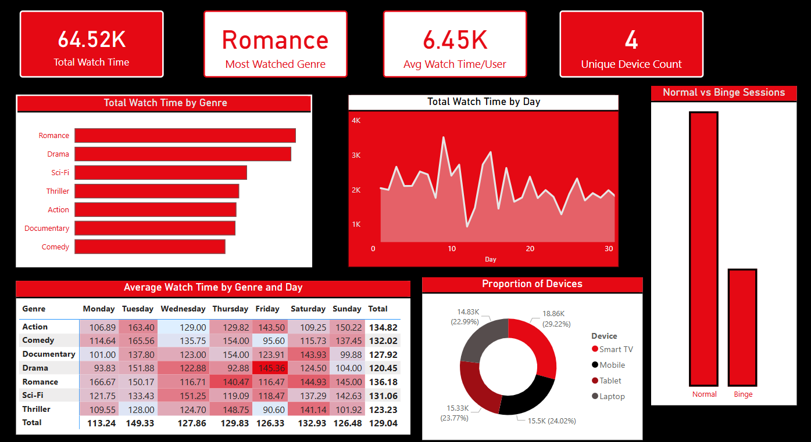

# 🎬 Netflix WatchTim Insights 📊

An interactive Power BI dashboard that analyzes simulated streaming behavior to uncover insights on user watch-time, binge sessions, genre popularity, and device usage patterns.

## 🚀 Project Overview

This project visualizes and interprets OTT (Over-The-Top) streaming data using Power BI. It includes real-world inspired metrics like binge session detection, most-watched genres, daily watch trends, and device distribution – designed with a Netflix-inspired visual theme for aesthetic and engagement.

### ✅ Key Objectives

- Analyze **user behavior** based on watch-time and session duration.
- Identify **binge-watching sessions** (≥ 180 minutes).
- Highlight **most-watched genres** and how they vary by day.
- Visualize **device usage proportions** across users.
- Track **watch-time trends** across the month.

---

## 📁 Dataset

A mock dataset was generated to simulate real OTT behavior, including:

- `User_ID` – unique viewer ID  
- `Genre` – type of content watched  
- `Device` – device used for viewing (Mobile, Laptop, Smart TV, etc.)  
- `Start Time` / `End Time` – to calculate watch duration  
- `Watch_Date` – for daily trend analysis  

The dataset includes **500 records** with varied durations, genres, and user-device combinations.

---

## 📈 Key Visuals in Dashboard

| Visual | Description |
|--------|-------------|
| **Cards** | Show Total Watch Time, Most Watched Genre, Average Watch Time/User, and Unique Device Count |
| **Bar Chart** | Normal vs Binge Sessions |
| **Line Chart** | Total Watch Time by Day |
| **Horizontal Bar** | Total Watch Time by Genre |
| **Donut Chart** | Device Usage Distribution |
| **Matrix Heatmap** | Avg. Watch Time by Genre & Day |

All visuals use a **Netflix-themed color palette** (red, black, white) for a cohesive and modern design.

---

## 🧠 Skills Demonstrated

- 📊 Power BI Data Modeling & DAX
- 🧮 Calculated Columns & Measures
- 🎨 Thematic Dashboard Design (Netflix-inspired)
- 🔍 User Behavior Analytics
- 📅 Time-Based Trend Analysis
- 📱 Device Distribution Breakdown

---

## 🖼️ Preview

  

---

## 📂 How to Use

1. Clone/download this repository.
2. Open the `.pbix` file in **Power BI Desktop**.
3. Explore or modify visuals/measures as needed.

---

